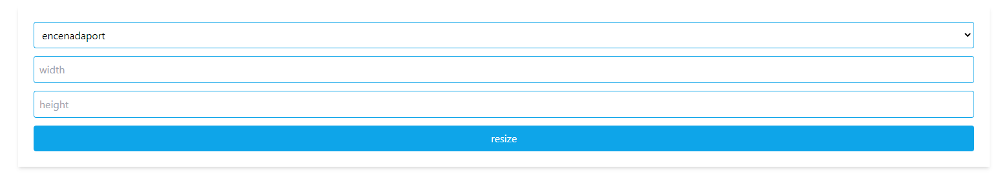
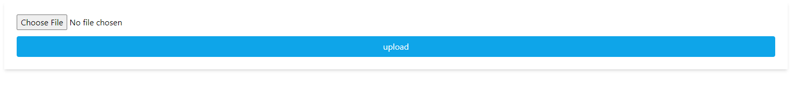
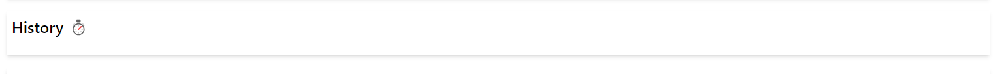
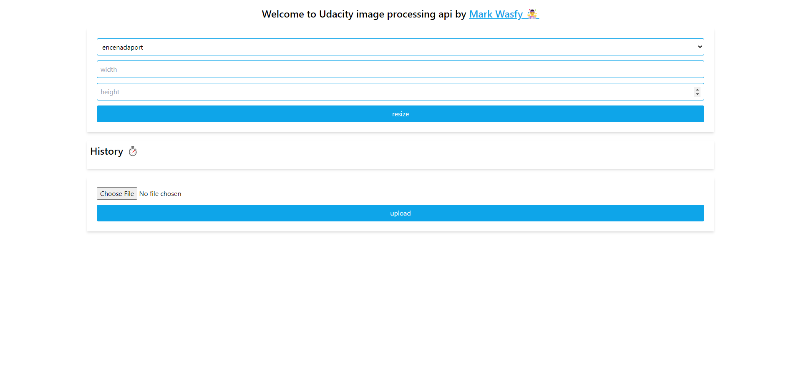

## Image Processing Api 🥇

### How to configure ⚙️
- npm install
- npm run build:prod
- npm preview
- open `localhost:3000`

## Main Functionality 🗜

Image processing api that resize given images to certain sizes

## Endpoints 🔌

#### That is resize endpoint - method => `GET`
`http://localhost:3000/api/images/?filename=fjord&width=200&height=200`

- filename => `required`
- width => `required`
- height => `required`

every query have its own validation to ensure no errors
it resize image and save it to the server

That is upload endpoint - method => `POST`
`http://localhost:3000/api/images`

you can use the frontend shortcut 

- image should be jpeg
- max size 10 mb

it will be added to the full folder in dist/assets
prefix with ISO date + image original name

## History 📆

Here you can see your previous histroy of your thumb folder

after you resized a image just do hard refresh `ctrl` + `R` to see the page updated on the home page

## Records 📃

in your dist/records.log you will see a record file that holds every request has been done to the server

## Main Frame 🖼

